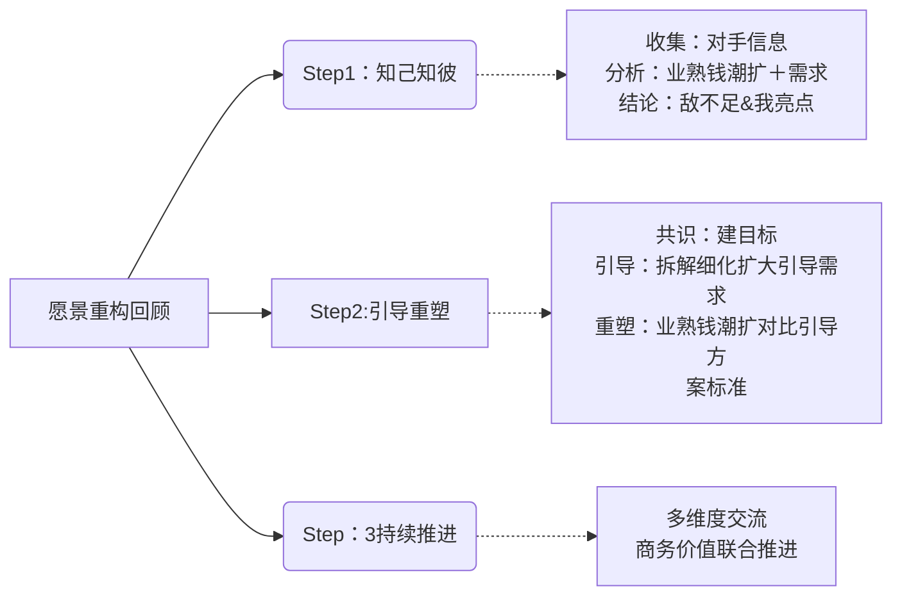
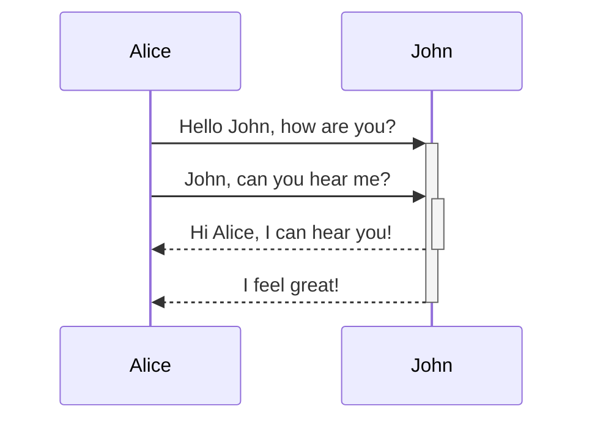
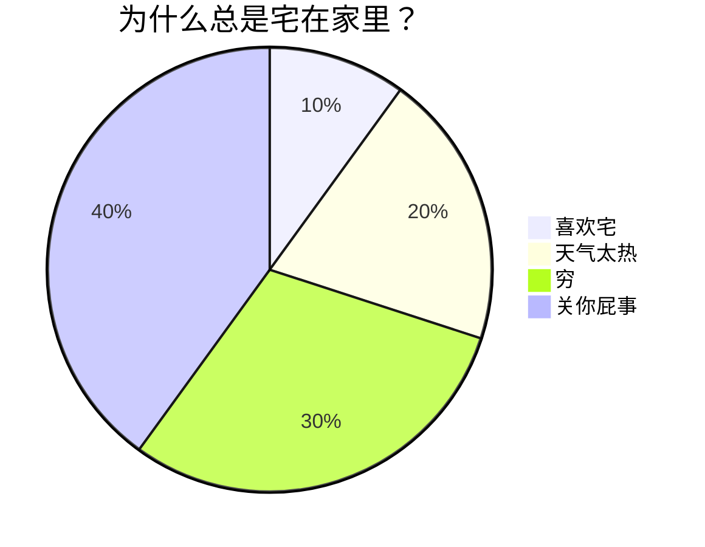

#S1学习类/S11修身/OB  #S0常用类 
***

# 代码块模块

```
我是代码块的内容
我是是来测试代码块的，你来看小到底是怎么回事儿吧
```

>计算机和信息工程学院 院长 张桂林 主任，专家：合肥工业大学原党委书记 李廉（教育部cernet管委会成员）、中国科学技术大学 信息中心副主任 张焕杰、安徽大学 现代教育技术中心主任 。


```
表格的对其方式的改变
左栏     |  中间栏  |   右栏 
:------- | :------: | -----: 
左对齐   |   居中   | 右对齐
```

`这是什么内容`

```
- [x] list syntax required (any unordered or ordered list supported) 
- [x] this is a complete item
- [ ] this is a complete item
```

- [ ] formatting supported
- [x] list syntax required (any unordered or ordered list supported)
- [ ] this is an incomplete item


<!-- 这里是注释的内容，阅读试图下不可见 -->

```
<!-- 这里是一行注释 -->

<!--
这里是
一段
假装有
很多行的
注释
-->

%%这是一行Obsidian里的注释%%

%%
这里是
一段
假装有
很多行的
Obsidian里的
注释
%%
```

# Mermaid流程图


```
  flowchart TB %% TB是上下布局，BT是下上布局；LR是左右布局，RL是右左布局；
      A("开始") -.- B["一级"];  %%虚线不带箭头；
      A --> C{"二级"}; %%实线带箭头；
      A -->|"说明说明，我这是<br>我这里有大量的说明的文字"| D("三级");中间增加的文字
	  B -.-> B1(("我是B的下级菜单"))
	  C --我是虚线之间的文本--> C1("我是C的下级菜单")
	  %% 这是一段注释内容,正式的图形现实中根本看不见，哈哈哈哈
	  %% 文字的外框，("A")圆角矩形，["A"]长方形，(("A"))圆形，{"A"}菱形；
```

```mermaid
  flowchart LR %% TB是上下布局，BT是下上布局；LR是左右布局，RL是右左布局；
      A("AAA") --> B("BBB");  %%虚线不带箭头；
      B --> C("CCC");  %%虚线不带箭头；
      C --> D("DDD");  %%虚线不带箭头；
	  %% 这是一段注释内容,正式的图形现实中根本看不见，哈哈哈哈
	  %% 文字的外框，("A")圆角矩形，["A"]长方形，(("A"))圆形，{"A"}菱形；
```

```mermaid
  flowchart TB %% TB是上下布局，BT是下上布局；LR是左右布局，RL是右左布局；
      A("开始") -.- B["一级"];  %%虚线不带箭头；
      A --> C{"二级"}; %%实线带箭头；
      A -->|"说明说明，我这是<br>我这里有大量的说明的文字"| D("三级")
	  B -.-> B1(("我是B的下级菜单"))
	  C --我是虚线之间的文本--> C1("我是C的下级菜单")
	  %% 这是一段注释内容,正式的图形现实中根本看不见，哈哈哈哈
```









https://publish.obsidian.md/csj-obsidian/0+-+Obsidian/Mermaid/Mermaid+流图


# Callout标注块模块
展开块
> [!Note]+ 我是标题 Note
> 我是警示的内容,下面还可以换行进行.
> 可以是多行的内容,

折叠块
> [!info]- 我是标题 Info
> 我是警示的内容,下面还可以换行进行.
> 可以是多行的内容,

正常块
> [!Todo] 我是标题- Todo
> 我是警示的内容,下面还可以换行进行.
> 可以是多行的内容,

> [!Warning] 我是标题
> 我是警示的内容,下面还可以换行进行.
> 可以是多行的内容,

> [!Tip] 我是标题- Tip
> 我是警示的内容,下面还可以换行进行.
> 可以是多行的内容,

> [!Success] 我是标题- Success
> 我是警示的内容,下面还可以换行进行.
> 可以是多行的内容,

> [!Question] 我是标题- Question
> 我是警示的内容,下面还可以换行进行.
> 可以是多行的内容,

> [!Abstract] 我是标题- Abstract
> 我是警示的内容,下面还可以换行进行.
> 可以是多行的内容,


> [!Failure] 我是标题- Failure
> 我是警示的内容,下面还可以换行进行.
> 可以是多行的内容,


> [!Danger] 我是标题- Danger
> 我是警示的内容,下面还可以换行进行.
> 可以是多行的内容,


> [!Bug] 我是标题- Bug
> 我是警示的内容,下面还可以换行进行.
> 可以是多行的内容,


> [!Example] 我是标题- Example
> 我是警示的内容,下面还可以换行进行.
> 可以是多行的内容,


> [!Quote] 我是标题- Quote
> 我是警示的内容,下面还可以换行进行.
> 可以是多行的内容,


